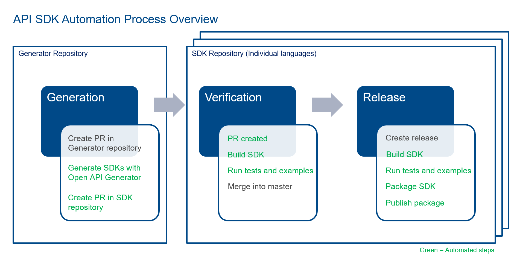

# Analytics API Engines SDK Generator

[](https://www.apache.org/licenses/LICENSE-2.0)

This repository contains all the configurations and customizations required to generate API client libraries (SDKs) for FactSet's Analytics API Engines product. It replies on the API's [OpenAPI Specification](https://github.com/OAI/OpenAPI-Specification) document and uses the [OpenAPI Generator](https://github.com/OpenAPITools/openapi-generator) tool for SDK generation.

Follow the below links for generated language specific SDK repositories.

* [Python](https://github.com/factset/analyticsapi-engines-python-sdk)
* [Dotnet](https://github.com/factset/analyticsapi-engines-dotnet-sdk)
* [Java](https://github.com/factset/analyticsapi-engines-java-sdk)

## Contents

* **[OpenAPI Specification](openapi-schema.json)** - The OpenAPI Specification document of the API
* **[Custom OpenAPI Generator](openapi-generator)** - Dockerized wrapper over OpenAPI Generator to support customizations
* **[Languages](languages)** - Directory containing OpenAPI Generator configurations `openapi-generator-config.json` and mustache template files `templates\*.mustache` to override default settings for individual languages

## Contributing

### Generate new version of the SDKs


**Note:** The steps highlighted in green are all automated using [GitHub Action Worflows](https://docs.github.com/en/actions/configuring-and-managing-workflows).

* **Generation**
  * Clone this repository and create a branch.
  * Replace `openapi-schema.json` with the latest version of API's OpenAPI Specification document.
  * Update the package versions in `languages/*/openapi-generator-config.json` files. Modify the rest of the configurations and template files as needed.
  * Raise a pull request with all above mentioned changes. This step will trigger a [GitHub Workflow](.github/workflows/pull-request.yml) that'll generate the SDKs and raise pull requests in each individual SDK repositories.

* **Validation**
  * Review the SDK pull requests and make changes as needed. Do not manually edit the auto-generated SDK code. Modifications should only be made in the pull request created in this repository and workflow will automatically apply them to the corresponding SDK pull requests. Follow these steps until the SDK looks good.
  * Creation of the pull requests in SDK repositories will automatically kicks off another GitHub workflow that builds the SDK, run tests and performs other sanity checks.
  * Update the tests and examples projects in the SDK repositories to match the latest SDK version.
  * If everything looks good, merge the pull requests to master branch in all repositories (Generator as well as all SDK repositories).

* **Release**
  * Create a release in the SDK repositories once the SDKs are ready to be published. This will trigger another GitHub workflow that'll package up the SDKs and publish them to the public package managers.

### Configure new language

* Check if OpenAPI Generator supports the language - [supported client generator](https://openapi-generator.tech/docs/generators#client-generators).
* If the language is supported, note the generator name for it. We'll call it `<<generator-name>>`.
* Clone this repository and create a branch.
* Add a new directory `languages/<<language-name>>`.
* Create a configuration file `languages/<<language-name>>/openapi-generator-config.json`.
* Add a directory `languages/<<language-name>>/templates`.
* (Optional) Add custom templates for your generator. Check [OpenAPI Generator Templates](https://openapi-generator.tech/docs/templating) for more information.
* (Optional) For most cases, modification to existing mustache template files will suffice but this repository adds a layer of [customization](https://openapi-generator.tech/docs/customization) and introduces custom generators (listed below). These allow you to add custom template files that are not supported by the default OpenAPI generator. For example, in this project the Utility API files `languages/*/utility_api.mustache` and `languages/*/utility_api_doc.mustache` (documentation) are added to each SDK and exposes helpful methods that users can leverage. Similar custom generators can be included in `openapi-generator/codegen/` directory or existing ones can be modified based on requirement.
  * CustomCSharpNetCoreClientCodegen
  * CustomPythonClientCodegen
* Create the corresponding language SDK repository.
* Add a new job to the [GitHub Workflow](.github/workflows/pull-request.yml) file as shown below to make the new language SDK generation part of the automated process.

```yml
...
...
env:
    GITHUB_<<language-name>>_SDK_REPO: <<sdk-repository-location>>
...
...
jobs:
...
...
    <<language-name>>:
        runs-on: ubuntu-latest

        steps:
        - name: Check out SDK repository
            if: env.GITHUB_<<language-name>>_SDK_REPO
            uses: actions/checkout@v2
            with:
            repository: ${{ env.GITHUB_<<language-name>>_SDK_REPO }}
            path: sdk
            fetch-depth: 0
            token: ${{ env.USER_API_KEY }}

        - name: Check out Generator repository
            if: env.GITHUB_<<language-name>>_SDK_REPO
            uses: actions/checkout@v2
            with:
            path: generator

        - name: Generate SDK
            if: env.GITHUB_<<language-name>>_SDK_REPO
            run: generator/.github/scripts/generate-sdk.sh $OPENAPI_GENERATOR_VERSION <<language-name>> <<generator-name>>

        - name: Raise pull request on SDK repository
            if: env.GITHUB_<<language-name>>_SDK_REPO
            run: generator/.github/scripts/raise-pull-request.sh <<language-name>>
```

## Generation of SDKs locally

### Prerequisites

* [Docker](https://www.docker.com/)

### Steps

1. Build the Docker image

    ```sh
    docker build --build-arg VERSION=4.3.1 \
        -t openapi-generator-cli-custom \
        -f ./openapi-generator/Dockerfile \
        ./openapi-generator
    ```

2. Run the Docker image to generate SDK. The `languages/*/sdk` directory will contain the generated files. In the below script, replace the `<<generator-name>>` with standard OpenAPI generator names or custom ones supported by this repository.

    ```sh
    docker run --rm -v ${PWD}:/generator \
        openapi-generator-cli-custom generate \
        --generator-name <<generator-name>> \
        --input-spec /generator/openapi-schema.json \
        --output /generator/languages/<<directory-name>>/sdk \
        --config /generator/languages/<<directory-name>>/openapi-generator-config.json \
        --template-dir /generator/languages/<<directory-name>>/templates \
        --skip-validate-spec
    ```

**Note:** The gitignore file is configured to ignore the `languages/*/sdk` directories. These are only for local testing purposes and should not be checked in.
